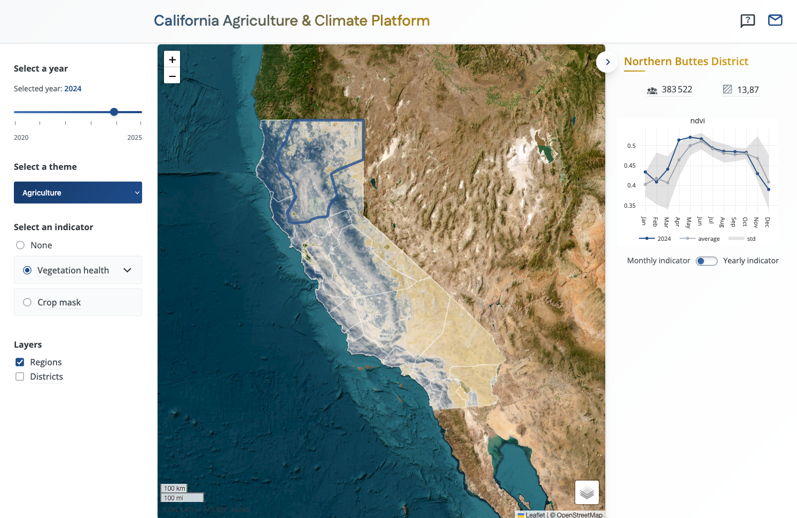
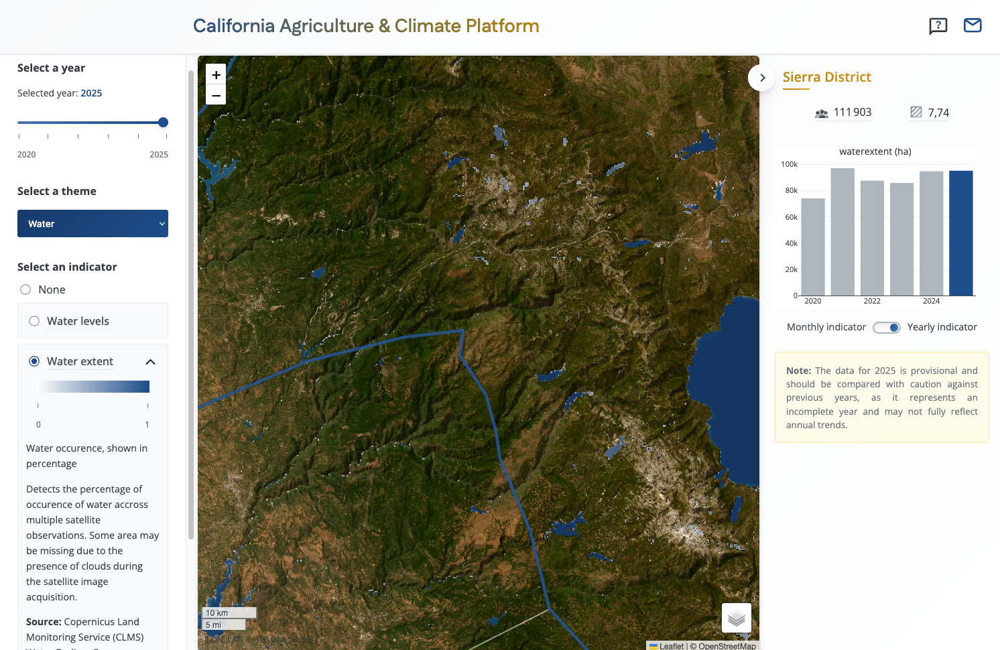

# California Agricultural & Climate Data Visualization Platform

A web-based GIS platform for visualizing agricultural and climatic variables in California using Leaflet. The platform provides interactive mapping capabilities with time series analysis for multiple environmental and demographic indicators.

## Overview

This platform enables users to explore and analyze:
- **Agriculture**: NDVI (vegetation health), crop masks
- **Climate**: Precipitation patterns, land surface temperature
- **Water**: Water levels, water extent monitoring
- **Population**: Population density and distribution

The application is built with vanilla JavaScript and Leaflet, requiring no backend server. All data processing is performed offline using Python notebooks, generating pre-computed TIFF files for map visualization and JSON files for time series charts.

## Screenshots

### Main Interface

*Interactive map showing agricultural indicators across California regions with the control panel*

### Data Visualization

*Detailed regional statistics with time series charts for selected indicators*

## Project Structure

```
.
├── html/                         # Web application files
│   ├── index.html                # Main application page
│   ├── healthcheck.html          # Health check endpoint
│   └── resources/
│       ├── js/
│       │   └── app.js            # Main application logic
│       ├── css/
│       │   └── main.css          # Application styles
│       └── img/                  # Images and icons
├── notebooks/                    # Data processing notebooks
│   ├── chirps.ipynb              # CHIRPS precipitation data
│   ├── modis_ndvi.ipynb          # MODIS NDVI data
│   ├── modis_lst.ipynb           # MODIS land surface temperature
│   ├── dahiti.ipynb              # Water level data
│   ├── ghsl.ipynb                # Population data
│   ├── clms.ipynb                # Crop mask data
│   ├── generate_json.ipynb       # Generate time series JSON
│   └── generate_colormaps.ipynb  # Generate color map legends
├── data/                         # Processed data outputs
│   ├── aggregates/               # Yearly TIFF aggregates
│   ├── indicators/               # JSON time series data
│   ├── admin/                    # Administrative boundaries
│   ├── chirps/                   # Raw CHIRPS data
│   ├── clms/                     # Raw crop mask data
│   ├── dahiti/                   # Raw water level data
│   ├── ghsl/                     # Raw population data
│   └── modis/                    # Raw MODIS data
├── python/                       # Python utility modules
├── requirements.txt              # Python dependencies
└── README.md                     # This file
```

## Features

- **Interactive Map**: Leaflet-based mapping interface with layer controls
- **Multi-year Analysis**: Year slider (2020-2024) for temporal analysis
- **Theme-based Navigation**: Organized by Agriculture, Climate, Water, and Population themes
- **Time Series Charts**: Plotly.js visualizations showing trends over time
- **Regional Statistics**: Click regions to view detailed statistics and charts
- **Responsive Design**: Works across desktop and mobile devices
- **Tutorial Mode**: Built-in guided tour using Intro.js

## Data Sources

The platform integrates data from multiple satellite and climate sources:

- **CHIRPS**: Climate Hazards Group InfraRed Precipitation with Station data
- **MODIS**: Moderate Resolution Imaging Spectroradiometer (NDVI, LST)
- **DAHITI**: Database for Hydrological Time Series (water levels)
- **GHSL**: Global Human Settlement Layer (population)
- **Copernicus CLMS**: Land Monitoring Service (crop masks)

## Setup

### Prerequisites

- Python 3.8+
- Modern web browser (Chrome, Firefox, Safari, Edge)
- Web server for serving static files (optional for local development)

### Python Environment Setup

1. Clone the repository:
```bash
git clone https://github.com/pierre-db/california-gis-platform.git
cd california-gis-platform
```

2. Create a virtual environment:
```bash
python -m venv venv
source venv/bin/activate  # On Windows: venv\Scripts\activate
```

3. Install dependencies:
```bash
pip install -r requirements.txt
```

### Environment Variables Configuration

This project uses environment variables for API credentials and configuration. We recommend using **direnv** with a `.envrc` file for automatic environment management.

#### Setting up direnv

1. **Install direnv** (if not already installed):
   ```bash
   # macOS
   brew install direnv

   # Ubuntu/Debian
   sudo apt-get install direnv

   # Add to your shell (choose one):
   # For bash: add to ~/.bashrc
   eval "$(direnv hook bash)"

   # For zsh: add to ~/.zshrc
   eval "$(direnv hook zsh)"
   ```

2. **Create a `.envrc` file** in the project root:
   ```bash
   touch .envrc
   ```

3. **Add the following environment variables** to `.envrc`:
   ```bash
   # DAHITI API Key for water levels data
   export DAHITI_API_KEY='your-dahiti-api-key'

   # Copernicus Data Space credentials for water extent data
   export COPERNICUS_USERNAME='your-copernicus-email'
   export COPERNICUS_S3_ACCESS_KEY='your-copernicus-s3-access-key'
   export COPERNICUS_S3_SECRET_KEY='your-copernicus-s3-secret-key'

   # Terracotta custom colormaps folder (if using local tile server)
   export TC_EXTRA_CMAP_FOLDER=../data/colormaps
   ```

4. **Allow direnv** to load the file:
   ```bash
   direnv allow
   ```

#### Required Credentials by Data Source

**No credentials needed:**
- `precipitations` (CHIRPS)
- `cropmask` (Copernicus CLMS)
- `population` (GHSL)
- `ndvi` (MODIS - via public access)
- `temperature` (MODIS - via public access)

**DAHITI API Key:**
- `waterlevels` (DAHITI water levels)
- **How to obtain**:
  1. Visit the [DAHITI database](https://dahiti.dgfi.tum.de/en/)
  2. Request API access through their contact form
  3. Add the provided key to your `.envrc` file

**Copernicus S3 Credentials:**
- `waterextent` (CLMS Water Bodies)
- **How to obtain**:
  1. Register for a free account at [Copernicus Data Space](https://dataspace.copernicus.eu/)
  2. Follow the [S3 Access documentation](https://documentation.dataspace.copernicus.eu/APIs/S3.html) to generate S3 credentials
  3. Add your access key and secret key to your `.envrc` file

#### Security Note

**Important**: Never commit your `.envrc` file with actual credentials to version control. The `.envrc` file should be added to `.gitignore`. You can create a `.envrc.example` template file for other developers.

### Data Processing

The Jupyter notebooks in the `notebooks/` directory handle all data acquisition and processing:

1. **Download Raw Data**: Run the individual data source notebooks (e.g., `chirps.ipynb`, `modis_ndvi.ipynb`) to download raw satellite/climate data

2. **Generate Aggregates**: Process raw data into yearly TIFF aggregates stored in `data/aggregates/`

3. **Generate Time Series**: Run `generate_json.ipynb` to create JSON files for time series charts in `data/indicators/`

4. **Generate Color Maps**: Run `generate_colormaps.ipynb` to create legend images for each indicator

### Setting Up Terracotta Tile Server (Optional)

If you want to serve raster tiles dynamically instead of using a remote tile server, you can set up a local Terracotta server:

#### Install Terracotta

```bash
# should already be installed via the requirements.txt
pip install terracotta[recommended] 
```

#### Optimize and Ingest Rasters

```bash
cd terracotta/

# Step 1: Optimize rasters (convert to Cloud Optimized GeoTIFF)
terracotta optimize-rasters ../data/aggregates/*.tif -o rasters/

# Alternative with GDAL:
# for file in ../data/aggregates/*.tif; do
#     name=$(basename "$file" .tif)
#     gdal_translate "$file" "rasters/${name}.tif" \
#         -of COG -co TILED=YES -co COMPRESS=DEFLATE -co PREDICTOR=2
# done

# Step 2: Ingest into database (pattern: {indicator}_{year}.tif)
terracotta ingest rasters/{name}_{date}.tif -o terracotta.sqlite
```

#### Start the Server

```bash
# Basic startup
terracotta serve -d terracotta.sqlite

# With custom colormaps (if you created custom colormaps in data/colormaps/)
export TC_EXTRA_CMAP_FOLDER=../data/colormaps
terracotta serve -d terracotta.sqlite
```

The tile server will be available at `http://localhost:5001`

**Note**: Custom colormaps in `data/colormaps/` (e.g., `calif_blues.npy`, `calif_yellows.npy`) will be available by their base name (e.g., `calif_blues`, `calif_yellows`) in your tile requests

To use the local tile server, update the `tileServerUrl` in `html/resources/js/app.js`:
```javascript
const appState = {
    // ...
    tileServerUrl: "http://localhost:5001",  // Change this to your Terracotta server URL
    // ...
};
```

### Running the Application

#### Option 1: Python HTTP Server
```bash
cd html
python -m http.server 8000
```
Navigate to `http://localhost:8000`

#### Option 2: Node.js HTTP Server
```bash
cd html
npx http-server -p 8000
```

#### Option 3: Any Static File Server
Point your web server to serve files from the `html/` directory.

## Usage

1. **Select a Year**: Use the year slider to choose a year between 2020-2024

2. **Choose a Theme**: Select from Agriculture, Climate, Water, or Population categories

3. **Pick an Indicator**: Choose a specific indicator to display on the map (e.g., NDVI, Precipitation)

4. **Explore the Map**:
   - Click on regions to view detailed statistics
   - View time series charts in the right panel
   - Toggle between monthly and yearly views

5. **Layer Controls**: Toggle administrative boundaries and other reference layers

## Development

### Key Technologies

- **Frontend**: Vanilla JavaScript (ES6+)
- **Mapping**: Leaflet 1.9.4
- **Charts**: Plotly.js 2.25.2
- **UI**: Intro.js for tutorials
- **Data Processing**: Python with geospatial libraries

### Python Dependencies

- `geopandas`: Vector data handling
- `rasterio`: Raster data I/O
- `rasterstats`: Zonal statistics
- `xarray`, `rioxarray`: NetCDF and geospatial array processing
- `netCDF4`: NetCDF file format support
- `beautifulsoup4`: Web scraping for data downloads
- `boto3`: AWS S3 access for public datasets

### Adding New Indicators

1. Create a new Jupyter notebook in `notebooks/` to download and process the data
2. Generate yearly TIFF aggregates in `data/aggregates/`
3. Create JSON time series in `data/indicators/`
4. Update the HTML indicators list in [index.html](html/index.html)
5. Add display logic in [app.js](html/resources/js/app.js)

## Data Processing Workflow

```
Raw Data Download -> Data Cleaning -> Spatial Aggregation -> Export
     (notebooks)         (Python)        (rasterio)        (TIFF/JSON)
```

1. **Download**: Notebooks fetch data from public APIs/repositories
2. **Process**: Clean, reproject, and resample to consistent grid
3. **Aggregate**: Calculate yearly statistics (mean, sum, etc.)
4. **Export**: Save as TIFF (for map display) and JSON (for charts)

## Acknowledgments

This platform uses data from various open data sources and satellite missions. Special thanks to:
- NASA MODIS mission
- CHIRPS precipitation dataset
- Copernicus Land Monitoring Service
- Global Human Settlement Layer project
- DAHITI database
